# CALM

**metamodel version:** 1.11.0

**version:** 1.2

LinkML representation of the FINOS Common Architecture Language Model (CALM) 1.2 specification. CALM is a declarative, JSON-based modeling language for describing complex software architectures (nodes, relationships, controls, flows, decorators, timelines, evidence, and units). This LinkML schema is generated from the CALM JSON-Schema meta files.

## Class Diagram

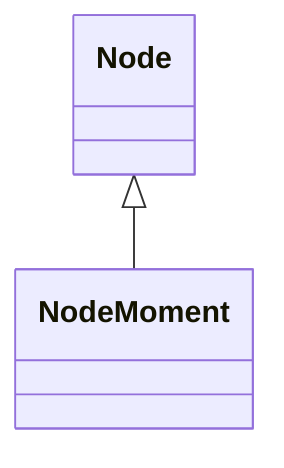

## ERD Diagram

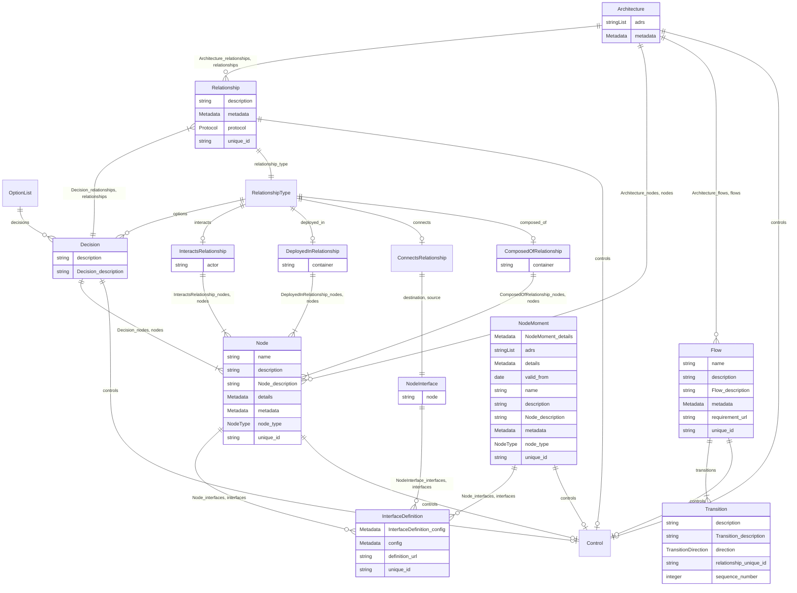

## Base Classes

Foundational classes in the hierarchy (root classes and direct children of Thing):

| Class | Description |
| --- | --- |
| [Node](#Node) | A logical or physical element of an architecture (system, service, actor, ...). |

## Standalone Classes

These classes are completely isolated with no relationships and are not used as base classes:

| Class | Description |
| --- | --- |
| [ControlDetail](#ControlDetail) | A single control requirement and its inline / referenced configuration. |
| [ControlRequirement](#ControlRequirement) | Domain-defined control requirement that controls can reference. |
| [Decorator](#Decorator) | Cross-cutting annotation attached to nodes, relationships, or flows. |
| [EvidenceDocument](#EvidenceDocument) | Top-level CALM evidence document linking control configurations to evidence artefacts. |
| [InterfaceType](#InterfaceType) | Inline (free-form) interface definition keyed by unique-id. |
| [RateUnit](#RateUnit) | A rate (count per time unit), e.g. operations per second. |
| [TimeUnit](#TimeUnit) | A quantity of time expressed as a numeric value and a unit. |
| [Timeline](#Timeline) | CALM timeline document capturing architecture moments over time. |

## Classes

### Architecture

Top-level CALM architecture document.

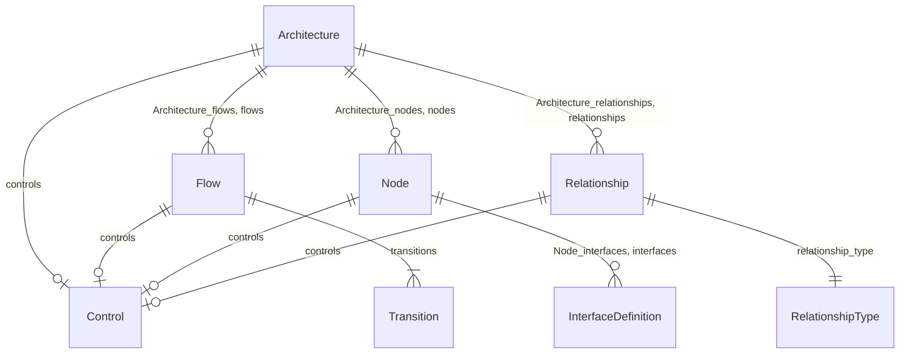

#### Attributes

| Name | Cardinality: | Type | Description |
| --- | --- | --- | --- |
| **[Architecture_flows](#ArchitectureFlows)** | 0..\* | [Flow](#Flow) |  |
| **[Architecture_nodes](#ArchitectureNodes)** | 0..\* | [Node](#Node) |  |
| **[Architecture_relationships](#ArchitectureRelationships)** | 0..\* | [Relationship](#Relationship) |  |
| **[adrs](#Adrs)** | 0..\* | string | External links to ADRs (Architecture Decision Records) or similar documents that provide context or decisions related to the architecture. These can be URLs or references to internal documentation. |
| **[controls](#Controls)** | 0..1 | [Control](#Control) |  |
| **[flows](#Flows)** | 0..\* | [Flow](#Flow) |  |
| **[metadata](#Metadata)** | 0..1 | Metadata |  |
| **[nodes](#Nodes)** | 0..\* | [Node](#Node) |  |
| **[relationships](#Relationships)** | 0..\* | [Relationship](#Relationship) |  |

### ComposedOfRelationship

A ``composed-of`` containment relationship.

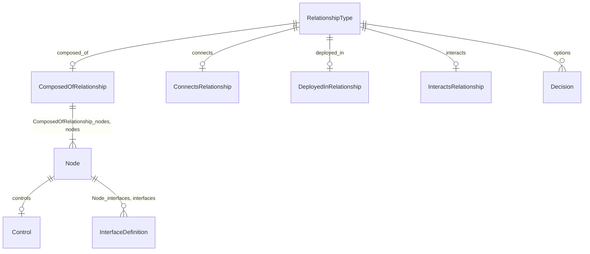

#### Attributes

| Name | Cardinality: | Type | Description |
| --- | --- | --- | --- |
| **[ComposedOfRelationship_nodes](#ComposedOfRelationshipNodes)** | 1..\* | [Node](#Node) |  |
| **[container](#Container)** | 1..1 | string |  |
| **[nodes](#Nodes)** | 1..\* | [Node](#Node) |  |

#### Referenced by:

 *  **[RelationshipType](#RelationshipType)** : composed_of  0..1 

### ConnectsRelationship

A ``connects`` relationship between two node interfaces.

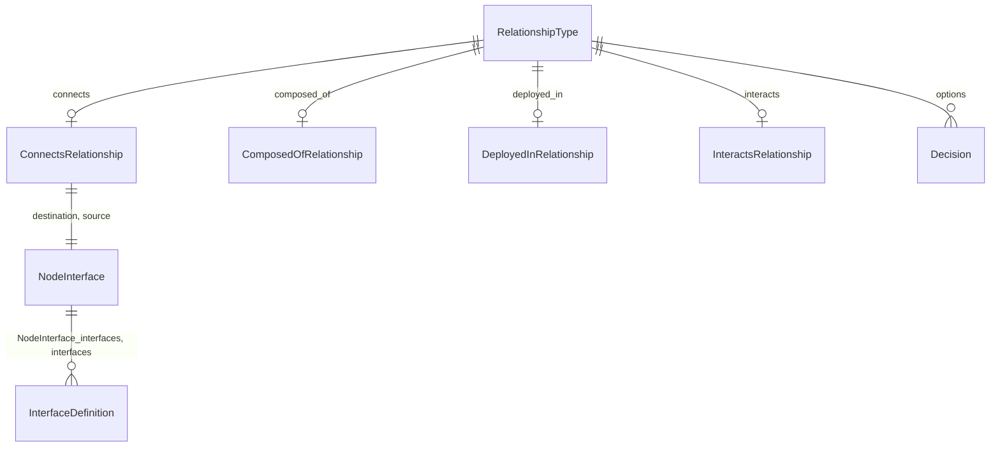

#### Attributes

| Name | Cardinality: | Type | Description |
| --- | --- | --- | --- |
| **[destination](#Destination)** | 1..1 | [NodeInterface](#NodeInterface) |  |
| **[source](#Source)** | 1..1 | [NodeInterface](#NodeInterface) |  |

#### Referenced by:

 *  **[RelationshipType](#RelationshipType)** : connects  0..1 

### Control

A named control attached to an architecture element.

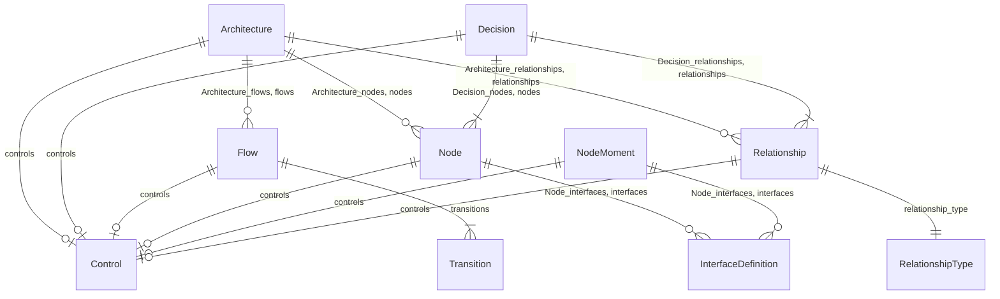

This class has no attributes

#### Referenced by:

 *  **[Architecture](#Architecture)** : controls  0..1 
 *  **[Decision](#Decision)** : controls  0..1 
 *  **[Flow](#Flow)** : controls  0..1 
 *  **[Node](#Node)** : controls  0..1 
 *  **[NodeMoment](#NodeMoment)** : controls  0..1 
 *  **[Relationship](#Relationship)** : controls  0..1 

### ControlDetail

A single control requirement and its inline / referenced configuration.

#### Attributes

| Name | Cardinality: | Type | Description |
| --- | --- | --- | --- |
| **[ControlDetail_requirement_url](#ControlDetailRequirementUrl)** | 1..1 | string | The requirement schema that specifies how a control should be defined |
| **[config](#Config)** | 0..1 | Metadata | Inline configuration of how the control requirement schema is met |
| **[config_url](#ConfigUrl)** | 0..1 | string | The configuration of how the control requirement schema is met |
| **[requirement_url](#RequirementUrl)** | 1..1 | string | The requirement schema that specifies how a control should be defined |

### ControlRequirement

Domain-defined control requirement that controls can reference.

#### Attributes

| Name | Cardinality: | Type | Description |
| --- | --- | --- | --- |
| **[name](#Name)** | 1..1 | string | Short human-readable name. |
| **[description](#Description)** | 1..1 | string | Free-form description of the element. |
| **[ControlRequirement_description](#ControlRequirementDescription)** | 1..1 | string | Free-form description of the element. |
| **[control_id](#ControlId)** | 1..1 | string | The unique identifier of this control, which has the potential to be used for linking evidence |

### Decision

A candidate decision within an ``options`` relationship.

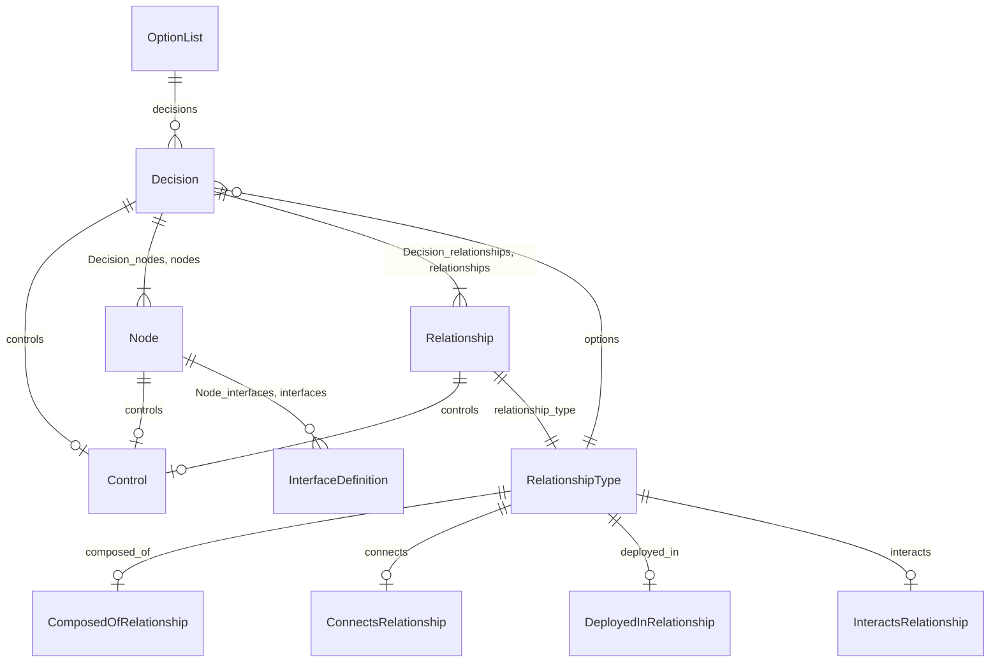

#### Attributes

| Name | Cardinality: | Type | Description |
| --- | --- | --- | --- |
| **[description](#Description)** | 1..1 | string | Free-form description of the element. |
| **[Decision_description](#DecisionDescription)** | 1..1 | string | Free-form description of the element. |
| **[Decision_nodes](#DecisionNodes)** | 1..\* | [Node](#Node) |  |
| **[Decision_relationships](#DecisionRelationships)** | 1..\* | [Relationship](#Relationship) |  |
| **[controls](#Controls)** | 0..1 | [Control](#Control) |  |
| **[nodes](#Nodes)** | 1..\* | [Node](#Node) |  |
| **[relationships](#Relationships)** | 1..\* | [Relationship](#Relationship) |  |

#### Referenced by:

 *  **[OptionList](#OptionList)** : decisions  0..\* 
 *  **[RelationshipType](#RelationshipType)** : options  0..\* 

### Decorator

Cross-cutting annotation attached to nodes, relationships, or flows.

#### Attributes

| Name | Cardinality: | Type | Description |
| --- | --- | --- | --- |
| **[applies_to](#AppliesTo)** | 1..\* | string | Array of unique-ids referencing nodes, relationships, flows, or other architecture elements |
| **[data](#Data)** | 1..1 | Metadata | Free-form JSON object containing the decorator's data |
| **[target](#Target)** | 1..\* | string | Array of file paths or URLs referencing the CALM documents (patterns, architectures, or controls) this decorator targets |
| **[type](#Type)** | 1..1 | string | Type of decorator - a free-form string identifying the decorator category |
| **[unique_id](#UniqueId)** | 1..1 | string | Stable opaque identifier used to cross-link CALM elements. |

### DeployedInRelationship

A ``deployed-in`` containment relationship.

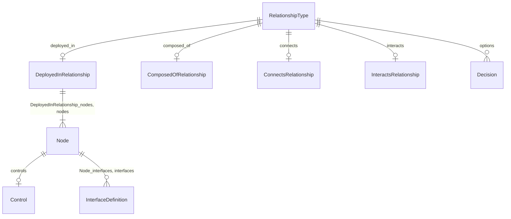

#### Attributes

| Name | Cardinality: | Type | Description |
| --- | --- | --- | --- |
| **[DeployedInRelationship_nodes](#DeployedInRelationshipNodes)** | 1..\* | [Node](#Node) |  |
| **[container](#Container)** | 1..1 | string |  |
| **[nodes](#Nodes)** | 1..\* | [Node](#Node) |  |

#### Referenced by:

 *  **[RelationshipType](#RelationshipType)** : deployed_in  0..1 

### EvidenceDocument

Top-level CALM evidence document linking control configurations to evidence artefacts.

#### Attributes

| Name | Cardinality: | Type | Description |
| --- | --- | --- | --- |
| **[evidence](#Evidence)** | 1..1 | Metadata |  |

### Flow

Business flow mapped onto architecture relationships.

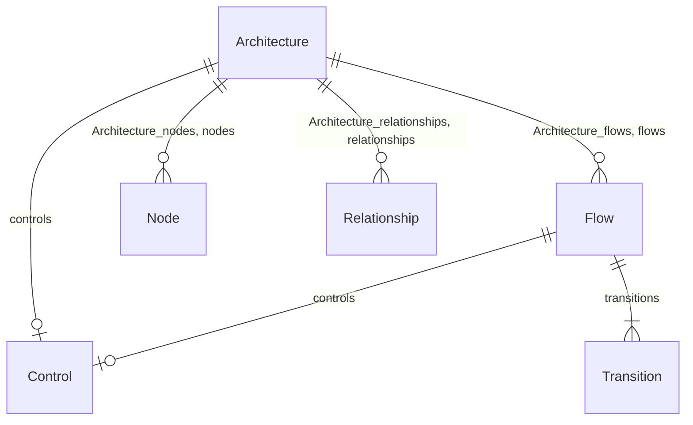

#### Attributes

| Name | Cardinality: | Type | Description |
| --- | --- | --- | --- |
| **[name](#Name)** | 1..1 | string | Short human-readable name. |
| **[description](#Description)** | 1..1 | string | Free-form description of the element. |
| **[Flow_description](#FlowDescription)** | 1..1 | string | Free-form description of the element. |
| **[controls](#Controls)** | 0..1 | [Control](#Control) |  |
| **[metadata](#Metadata)** | 0..1 | Metadata |  |
| **[requirement_url](#RequirementUrl)** | 0..1 | string | The requirement schema that specifies how a control should be defined |
| **[transitions](#Transitions)** | 1..\* | [Transition](#Transition) |  |
| **[unique_id](#UniqueId)** | 1..1 | string | Stable opaque identifier used to cross-link CALM elements. |

#### Referenced by:

 *  **[Architecture](#Architecture)** : flows  0..\* 
 *  **[Architecture](#Architecture)** : flows  0..\* 

### InteractsRelationship

An ``interacts`` relationship between an actor and one or more nodes.

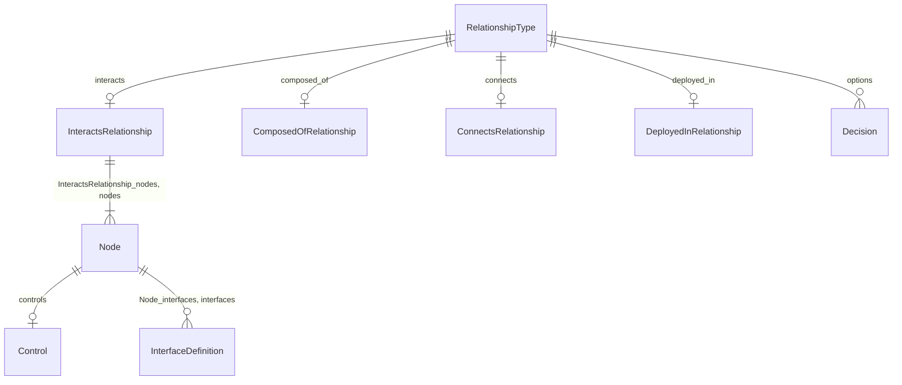

#### Attributes

| Name | Cardinality: | Type | Description |
| --- | --- | --- | --- |
| **[InteractsRelationship_nodes](#InteractsRelationshipNodes)** | 1..\* | [Node](#Node) |  |
| **[actor](#Actor)** | 1..1 | string |  |
| **[nodes](#Nodes)** | 1..\* | [Node](#Node) |  |

#### Referenced by:

 *  **[RelationshipType](#RelationshipType)** : interacts  0..1 

### InterfaceDefinition

Modular interface definition referencing an external schema.

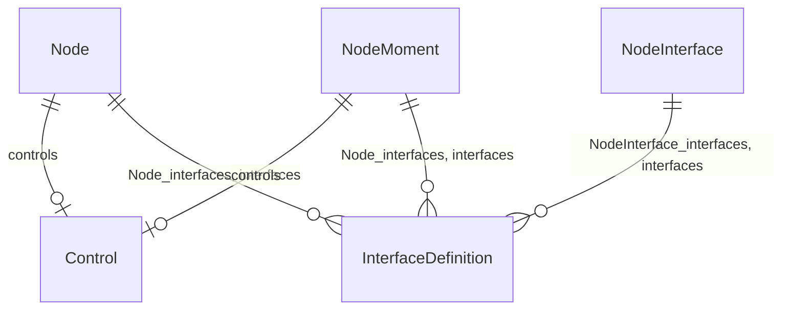

#### Attributes

| Name | Cardinality: | Type | Description |
| --- | --- | --- | --- |
| **[InterfaceDefinition_config](#InterfaceDefinitionConfig)** | 1..1 | Metadata | Inline configuration of how the control requirement schema is met |
| **[config](#Config)** | 1..1 | Metadata | Inline configuration of how the control requirement schema is met |
| **[definition_url](#DefinitionUrl)** | 1..1 | string | URI of the external schema this interface configuration conforms to |
| **[unique_id](#UniqueId)** | 1..1 | string | Stable opaque identifier used to cross-link CALM elements. |

#### Referenced by:

 *  **[NodeInterface](#NodeInterface)** : interfaces  0..\* 
 *  **[Node](#Node)** : interfaces  0..\* 
 *  **[Node](#Node)** : interfaces  0..\* 
 *  **[NodeInterface](#NodeInterface)** : interfaces  0..\* 
 *  **[NodeMoment](#NodeMoment)** : interfaces  0..\* 

### InterfaceType

Inline (free-form) interface definition keyed by unique-id.

#### Attributes

| Name | Cardinality: | Type | Description |
| --- | --- | --- | --- |
| **[unique_id](#UniqueId)** | 1..1 | string | Stable opaque identifier used to cross-link CALM elements. |

### Node

A logical or physical element of an architecture (system, service, actor, ...).

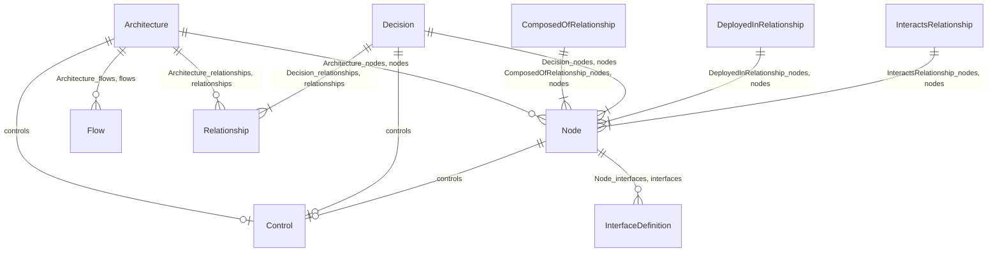

#### Attributes

| Name | Cardinality: | Type | Description |
| --- | --- | --- | --- |
| **[name](#Name)** | 1..1 | string | Short human-readable name. |
| **[description](#Description)** | 1..1 | string | Free-form description of the element. |
| **[Node_description](#NodeDescription)** | 1..1 | string | Free-form description of the element. |
| **[Node_interfaces](#NodeInterfaces)** | 0..\* | [InterfaceDefinition](#InterfaceDefinition) | Interface definitions exposed by nodes. |
| **[controls](#Controls)** | 0..1 | [Control](#Control) |  |
| **[details](#Details)** | 0..1 | Metadata |  |
| **[interfaces](#Interfaces)** | 0..\* | [InterfaceDefinition](#InterfaceDefinition) | Interface definitions exposed by nodes. |
| **[metadata](#Metadata)** | 0..1 | Metadata |  |
| **[node_type](#NodeType)** | 1..1 | [NodeType](#NodeType) | Category of the node (system, service, actor, etc.). |
| **[unique_id](#UniqueId)** | 1..1 | string | Stable opaque identifier used to cross-link CALM elements. |

#### Children

 * [NodeMoment](#NodeMoment) - An architecture moment - a point-in-time snapshot of the architecture.

#### Referenced by:

 *  **[Architecture](#Architecture)** : nodes  0..\* 
 *  **[ComposedOfRelationship](#ComposedOfRelationship)** : nodes  1..\* 
 *  **[Decision](#Decision)** : nodes  1..\* 
 *  **[DeployedInRelationship](#DeployedInRelationship)** : nodes  1..\* 
 *  **[InteractsRelationship](#InteractsRelationship)** : nodes  1..\* 
 *  **[Architecture](#Architecture)** : nodes  0..\* 
 *  **[ComposedOfRelationship](#ComposedOfRelationship)** : nodes  0..\* 
 *  **[Decision](#Decision)** : nodes  0..\* 
 *  **[DeployedInRelationship](#DeployedInRelationship)** : nodes  0..\* 
 *  **[InteractsRelationship](#InteractsRelationship)** : nodes  0..\* 

### NodeInterface

Reference to one or more interfaces exposed by a node.

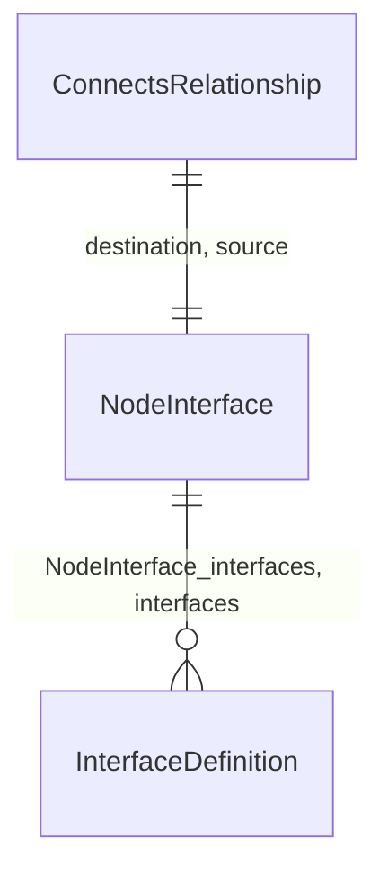

#### Attributes

| Name | Cardinality: | Type | Description |
| --- | --- | --- | --- |
| **[NodeInterface_interfaces](#NodeInterfaceInterfaces)** | 0..\* | [InterfaceDefinition](#InterfaceDefinition) | Interface definitions exposed by nodes. |
| **[interfaces](#Interfaces)** | 0..\* | [InterfaceDefinition](#InterfaceDefinition) | Interface definitions exposed by nodes. |
| **[node](#Node)** | 1..1 | string |  |

#### Referenced by:

 *  **[ConnectsRelationship](#ConnectsRelationship)** : destination  1..1 
 *  **[ConnectsRelationship](#ConnectsRelationship)** : source  1..1 

### NodeMoment

An architecture moment - a point-in-time snapshot of the architecture.

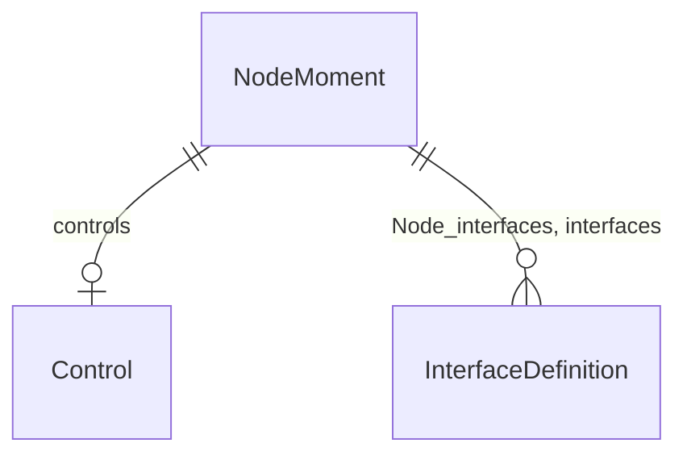

#### Attributes

| Name | Cardinality: | Type | Description |
| --- | --- | --- | --- |
| **[name](#Name)** | 1..1 | string | Short human-readable name. |
| **[description](#Description)** | 1..1 | string | Free-form description of the element. |
| **[Node_interfaces](#NodeInterfaces)** | 0..\* | [InterfaceDefinition](#InterfaceDefinition) | Interface definitions exposed by nodes. |
| **[NodeMoment_details](#NodeMomentDetails)** | 1..1 | Metadata |  |
| **[Node_description](#NodeDescription)** | 1..1 | string | Free-form description of the element. |
| **[adrs](#Adrs)** | 0..\* | string | External links to ADRs (Architecture Decision Records) or similar documents that provide context or decisions related to the architecture. These can be URLs or references to internal documentation. |
| **[controls](#Controls)** | 0..1 | [Control](#Control) |  |
| **[details](#Details)** | 1..1 | Metadata |  |
| **[interfaces](#Interfaces)** | 0..\* | [InterfaceDefinition](#InterfaceDefinition) | Interface definitions exposed by nodes. |
| **[metadata](#Metadata)** | 0..1 | Metadata |  |
| **[node_type](#NodeType)** | 1..1 | [NodeType](#NodeType) | Category of the node (system, service, actor, etc.). |
| **[unique_id](#UniqueId)** | 1..1 | string | Stable opaque identifier used to cross-link CALM elements. |
| **[valid_from](#ValidFrom)** | 0..1 | date | The date when this architecture moment came into effect. |

#### Parents

 * [Node](#Node) - A logical or physical element of an architecture (system, service, actor, ...).

### OptionList

Wrapper around the list of ``Decision`` alternatives in an options relationship.

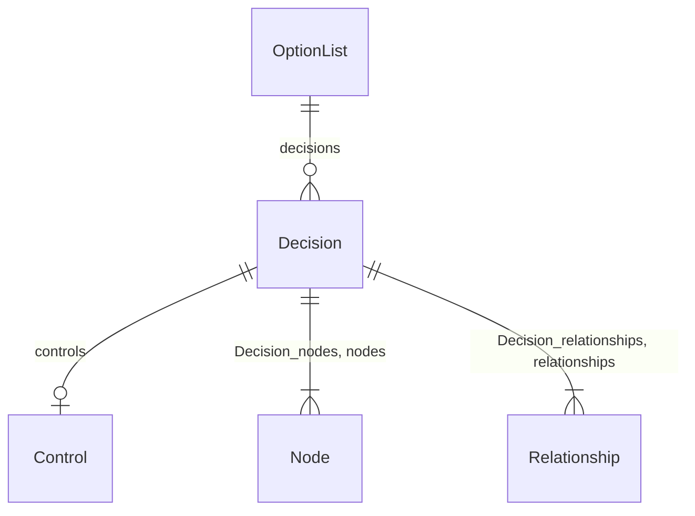

#### Attributes

| Name | Cardinality: | Type | Description |
| --- | --- | --- | --- |
| **[decisions](#Decisions)** | 0..\* | [Decision](#Decision) | Alternative decisions under an ``options`` relationship. |

### RateUnit

A rate (count per time unit), e.g. operations per second.

#### Attributes

| Name | Cardinality: | Type | Description |
| --- | --- | --- | --- |
| **[per](#Per)** | 1..1 | [RatePerUnit](#RatePerUnit) | The time unit defining the rate interval. |
| **[rate](#Rate)** | 1..1 | float | The numeric value representing the rate. |

### Relationship

A typed link between architecture elements.

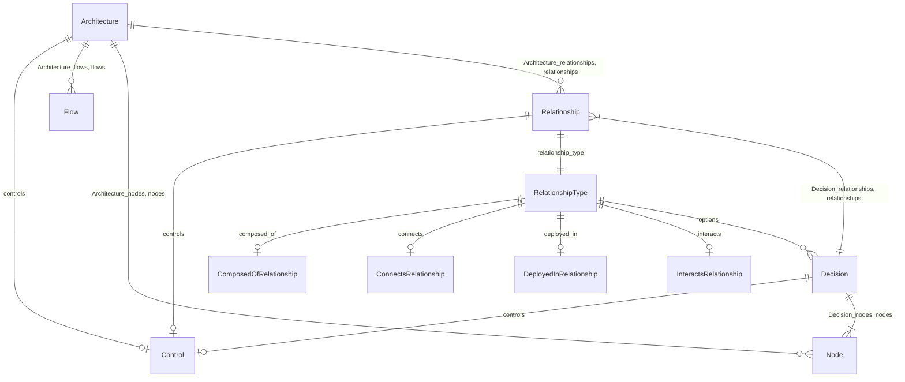

#### Attributes

| Name | Cardinality: | Type | Description |
| --- | --- | --- | --- |
| **[description](#Description)** | 0..1 | string | Free-form description of the element. |
| **[controls](#Controls)** | 0..1 | [Control](#Control) |  |
| **[metadata](#Metadata)** | 0..1 | Metadata |  |
| **[protocol](#Protocol)** | 0..1 | [Protocol](#Protocol) |  |
| **[relationship_type](#RelationshipType)** | 1..1 | [RelationshipType](#RelationshipType) |  |
| **[unique_id](#UniqueId)** | 1..1 | string | Stable opaque identifier used to cross-link CALM elements. |

#### Referenced by:

 *  **[Architecture](#Architecture)** : relationships  0..\* 
 *  **[Decision](#Decision)** : relationships  1..\* 
 *  **[Architecture](#Architecture)** : relationships  0..\* 
 *  **[Decision](#Decision)** : relationships  0..\* 

### RelationshipType

Tagged-union container for the variant body of a relationship. Exactly one of ``interacts``, ``connects``, ``deployed_in``, ``composed_of``, ``options`` is populated; see ``RelationshipKind`` for the discriminator values.

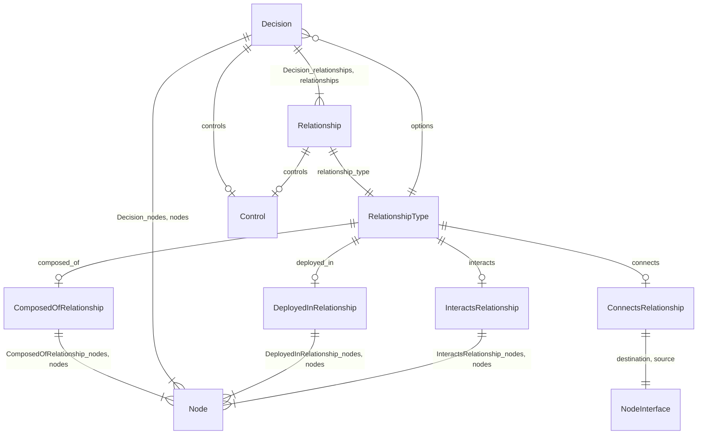

#### Attributes

| Name | Cardinality: | Type | Description |
| --- | --- | --- | --- |
| **[composed_of](#ComposedOf)** | 0..1 | [ComposedOfRelationship](#ComposedOfRelationship) |  |
| **[connects](#Connects)** | 0..1 | [ConnectsRelationship](#ConnectsRelationship) |  |
| **[deployed_in](#DeployedIn)** | 0..1 | [DeployedInRelationship](#DeployedInRelationship) |  |
| **[interacts](#Interacts)** | 0..1 | [InteractsRelationship](#InteractsRelationship) |  |
| **[options](#Options)** | 0..\* | [Decision](#Decision) |  |

#### Referenced by:

 *  **[Relationship](#Relationship)** : relationship_type  1..1 

### TimeUnit

A quantity of time expressed as a numeric value and a unit.

#### Attributes

| Name | Cardinality: | Type | Description |
| --- | --- | --- | --- |
| **[unit](#Unit)** | 1..1 | [TimeUnitName](#TimeUnitName) | The unit of time (e.g., seconds, minutes, hours). |
| **[value](#Value)** | 1..1 | float | The numeric value representing the amount of time. |

### Timeline

CALM timeline document capturing architecture moments over time.

#### Attributes

| Name | Cardinality: | Type | Description |
| --- | --- | --- | --- |
| **[current_moment](#CurrentMoment)** | 0..1 | string | The unique-id of the current architecture moment within the timeline. |
| **[metadata](#Metadata)** | 0..1 | Metadata |  |
| **[moments](#Moments)** | 1..\* | string | A list of significant architecture states or points in time, each represented as a 'moment'. |

### Transition

A single step in a flow, anchored on a relationship.

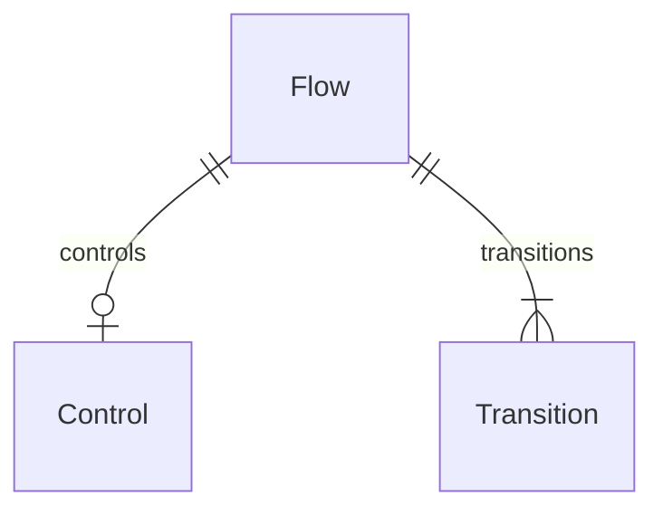

#### Attributes

| Name | Cardinality: | Type | Description |
| --- | --- | --- | --- |
| **[description](#Description)** | 1..1 | string | Free-form description of the element. |
| **[Transition_description](#TransitionDescription)** | 1..1 | string | Free-form description of the element. |
| **[direction](#Direction)** | 0..1 | [TransitionDirection](#TransitionDirection) | Direction of flow on the transition. |
| **[relationship_unique_id](#RelationshipUniqueId)** | 1..1 | string | Unique identifier for the relationship in the architecture |
| **[sequence_number](#SequenceNumber)** | 1..1 | integer | Indicates the sequence of the relationship in the flow |

#### Referenced by:

 *  **[Flow](#Flow)** : transitions  1..\* 

## Slots

| Name | Cardinality/Range | Used By |
| --- | --- | --- |
| **name** Short human-readable name. | 1..1 string | [ControlRequirement](#ControlRequirement), [Flow](#Flow), [Node](#Node), [NodeMoment](#NodeMoment) |
| **description** Free-form description of the element. | 0..1 string | [ControlRequirement](#ControlRequirement), [Decision](#Decision), [Flow](#Flow), [Node](#Node), [NodeMoment](#NodeMoment), [Relationship](#Relationship), [Transition](#Transition) |
| **Architecture_flows** | 0..\* [Flow](#Flow) | [Architecture](#Architecture) |
| **Architecture_nodes** | 0..\* [Node](#Node) | [Architecture](#Architecture) |
| **Architecture_relationships** | 0..\* [Relationship](#Relationship) | [Architecture](#Architecture) |
| **ComposedOfRelationship_nodes** | 1..\* [Node](#Node) | [ComposedOfRelationship](#ComposedOfRelationship) |
| **ControlDetail_requirement_url** The requirement schema that specifies how a control should be defined | 1..1 string | [ControlDetail](#ControlDetail) |
| **ControlRequirement_description** Free-form description of the element. | 1..1 string | [ControlRequirement](#ControlRequirement) |
| **Decision_description** Free-form description of the element. | 1..1 string | [Decision](#Decision) |
| **Decision_nodes** | 1..\* [Node](#Node) | [Decision](#Decision) |
| **Decision_relationships** | 1..\* [Relationship](#Relationship) | [Decision](#Decision) |
| **DeployedInRelationship_nodes** | 1..\* [Node](#Node) | [DeployedInRelationship](#DeployedInRelationship) |
| **Flow_description** Free-form description of the element. | 1..1 string | [Flow](#Flow) |
| **InteractsRelationship_nodes** | 1..\* [Node](#Node) | [InteractsRelationship](#InteractsRelationship) |
| **InterfaceDefinition_config** Inline configuration of how the control requirement schema is met | 1..1 Metadata | [InterfaceDefinition](#InterfaceDefinition) |
| **NodeInterface_interfaces** Interface definitions exposed by nodes. | 0..\* [InterfaceDefinition](#InterfaceDefinition) | [NodeInterface](#NodeInterface) |
| **NodeMoment_details** | 1..1 Metadata | [NodeMoment](#NodeMoment) |
| **Node_description** Free-form description of the element. | 1..1 string | [Node](#Node), [NodeMoment](#NodeMoment) |
| **Node_interfaces** Interface definitions exposed by nodes. | 0..\* [InterfaceDefinition](#InterfaceDefinition) | [Node](#Node), [NodeMoment](#NodeMoment) |
| **Transition_description** Free-form description of the element. | 1..1 string | [Transition](#Transition) |
| **actor** | 1..1 string | [InteractsRelationship](#InteractsRelationship) |
| **adrs** External links to ADRs (Architecture Decision Records) or similar documents that provide context or decisions related to the architecture. These can be URLs or references to internal documentation. | 0..\* string | [Architecture](#Architecture), [NodeMoment](#NodeMoment) |
| **applies_to** Array of unique-ids referencing nodes, relationships, flows, or other architecture elements | 1..\* string | [Decorator](#Decorator) |
| **composed_of** | 0..1 [ComposedOfRelationship](#ComposedOfRelationship) | [RelationshipType](#RelationshipType) |
| **config** Inline configuration of how the control requirement schema is met | 0..1 Metadata | [ControlDetail](#ControlDetail), [InterfaceDefinition](#InterfaceDefinition) |
| **config_url** The configuration of how the control requirement schema is met | 0..1 string | [ControlDetail](#ControlDetail) |
| **connects** | 0..1 [ConnectsRelationship](#ConnectsRelationship) | [RelationshipType](#RelationshipType) |
| **container** | 1..1 string | [ComposedOfRelationship](#ComposedOfRelationship), [DeployedInRelationship](#DeployedInRelationship) |
| **control_config_url** | 0..1 string |  |
| **control_id** The unique identifier of this control, which has the potential to be used for linking evidence | 1..1 string | [ControlRequirement](#ControlRequirement) |
| **controls** | 0..1 [Control](#Control) | [Architecture](#Architecture), [Decision](#Decision), [Flow](#Flow), [Node](#Node), [NodeMoment](#NodeMoment), [Relationship](#Relationship) |
| **current_moment** The unique-id of the current architecture moment within the timeline. | 0..1 string | [Timeline](#Timeline) |
| **data** Free-form JSON object containing the decorator's data | 1..1 Metadata | [Decorator](#Decorator) |
| **decisions** Alternative decisions under an ``options`` relationship. | 0..\* [Decision](#Decision) | [OptionList](#OptionList) |
| **definition_url** URI of the external schema this interface configuration conforms to | 1..1 string | [InterfaceDefinition](#InterfaceDefinition) |
| **deployed_in** | 0..1 [DeployedInRelationship](#DeployedInRelationship) | [RelationshipType](#RelationshipType) |
| **destination** | 1..1 [NodeInterface](#NodeInterface) | [ConnectsRelationship](#ConnectsRelationship) |
| **details** | 0..1 Metadata | [Node](#Node), [NodeMoment](#NodeMoment) |
| **direction** Direction of flow on the transition. | 0..1 [TransitionDirection](#TransitionDirection) | [Transition](#Transition) |
| **evidence** | 1..1 Metadata | [EvidenceDocument](#EvidenceDocument) |
| **evidence_paths** Paths (filesystem or URL) pointing at supporting evidence. | 0..\* string |  |
| **flows** | 0..\* [Flow](#Flow) | [Architecture](#Architecture) |
| **interacts** | 0..1 [InteractsRelationship](#InteractsRelationship) | [RelationshipType](#RelationshipType) |
| **interfaces** Interface definitions exposed by nodes. | 0..\* [InterfaceDefinition](#InterfaceDefinition) | [Node](#Node), [NodeInterface](#NodeInterface), [NodeMoment](#NodeMoment) |
| **metadata** | 0..1 Metadata | [Architecture](#Architecture), [Flow](#Flow), [Node](#Node), [NodeMoment](#NodeMoment), [Relationship](#Relationship), [Timeline](#Timeline) |
| **moments** A list of significant architecture states or points in time, each represented as a 'moment'. | 1..\* string | [Timeline](#Timeline) |
| **node** | 1..1 string | [NodeInterface](#NodeInterface) |
| **node_type** Category of the node (system, service, actor, etc.). | 1..1 [NodeType](#NodeType) | [Node](#Node), [NodeMoment](#NodeMoment) |
| **nodes** | 0..\* [Node](#Node) | [Architecture](#Architecture), [ComposedOfRelationship](#ComposedOfRelationship), [Decision](#Decision), [DeployedInRelationship](#DeployedInRelationship), [InteractsRelationship](#InteractsRelationship) |
| **options** | 0..\* [Decision](#Decision) | [RelationshipType](#RelationshipType) |
| **per** The time unit defining the rate interval. | 1..1 [RatePerUnit](#RatePerUnit) | [RateUnit](#RateUnit) |
| **protocol** | 0..1 [Protocol](#Protocol) | [Relationship](#Relationship) |
| **rate** The numeric value representing the rate. | 1..1 float | [RateUnit](#RateUnit) |
| **relationship_type** | 1..1 [RelationshipType](#RelationshipType) | [Relationship](#Relationship) |
| **relationship_unique_id** Unique identifier for the relationship in the architecture | 1..1 string | [Transition](#Transition) |
| **relationships** | 0..\* [Relationship](#Relationship) | [Architecture](#Architecture), [Decision](#Decision) |
| **requirement_url** The requirement schema that specifies how a control should be defined | 0..1 string | [ControlDetail](#ControlDetail), [Flow](#Flow) |
| **sequence_number** Indicates the sequence of the relationship in the flow | 1..1 integer | [Transition](#Transition) |
| **source** | 1..1 [NodeInterface](#NodeInterface) | [ConnectsRelationship](#ConnectsRelationship) |
| **target** Array of file paths or URLs referencing the CALM documents (patterns, architectures, or controls) this decorator targets | 1..\* string | [Decorator](#Decorator) |
| **transitions** | 1..\* [Transition](#Transition) | [Flow](#Flow) |
| **type** Type of decorator - a free-form string identifying the decorator category | 1..1 string | [Decorator](#Decorator) |
| **unique_id** Stable opaque identifier used to cross-link CALM elements. | 1..1 string | [Decorator](#Decorator), [Flow](#Flow), [InterfaceDefinition](#InterfaceDefinition), [InterfaceType](#InterfaceType), [Node](#Node), [NodeMoment](#NodeMoment), [Relationship](#Relationship) |
| **unit** The unit of time (e.g., seconds, minutes, hours). | 1..1 [TimeUnitName](#TimeUnitName) | [TimeUnit](#TimeUnit) |
| **url** | 0..1 string |  |
| **valid_from** The date when this architecture moment came into effect. | 0..1 date | [NodeMoment](#NodeMoment) |
| **value** The numeric value representing the amount of time. | 1..1 float | [TimeUnit](#TimeUnit) |

## Enums

### NodeType

Category of architecture node. The CALM JSON-Schema allows arbitrary strings; this enum lists the canonical values plus an escape hatch via ``any_of`` on the slot.

| Text | Meaning: | Description |
| --- | --- | --- |
| actor | calm:node-type/actor | A actor node. |
| data_asset | calm:node-type/data-asset | A data-asset node. |
| database | calm:node-type/database | A database node. |
| ecosystem | calm:node-type/ecosystem | A ecosystem node. |
| ldap | calm:node-type/ldap | A ldap node. |
| network | calm:node-type/network | A network node. |
| service | calm:node-type/service | A service node. |
| system | calm:node-type/system | A system node. |
| webclient | calm:node-type/webclient | A webclient node. |

#### Used by

 *  **[Node](#Node)** *[node_type](#NodeType)*  1..1 
 *  **[NodeMoment](#NodeMoment)** *[node_type](#NodeType)*  1..1 

### Protocol

Wire-level protocol used by a relationship.

| Text | Meaning: | Description |
| --- | --- | --- |
| AMQP | calm:protocol/AMQP | The AMQP protocol. |
| FTP | calm:protocol/FTP | The FTP protocol. |
| HTTP | calm:protocol/HTTP | The HTTP protocol. |
| HTTPS | calm:protocol/HTTPS | The HTTPS protocol. |
| JDBC | calm:protocol/JDBC | The JDBC protocol. |
| LDAP | calm:protocol/LDAP | The LDAP protocol. |
| SFTP | calm:protocol/SFTP | The SFTP protocol. |
| SocketIO | calm:protocol/SocketIO | The SocketIO protocol. |
| TCP | calm:protocol/TCP | The TCP protocol. |
| TLS | calm:protocol/TLS | The TLS protocol. |
| WebSocket | calm:protocol/WebSocket | The WebSocket protocol. |
| mTLS | calm:protocol/mTLS | The mTLS protocol. |

#### Used by

 *  **[Relationship](#Relationship)** *[protocol](#Protocol)*  0..1 

### RatePerUnit

Time interval denominator used by ``RateUnit``.

| Text | Meaning: | Description |
| --- | --- | --- |
| day | None | Rate denominator: per day. |
| hour | None | Rate denominator: per hour. |
| microsecond | None | Rate denominator: per microsecond. |
| millisecond | None | Rate denominator: per millisecond. |
| minute | None | Rate denominator: per minute. |
| month | None | Rate denominator: per month. |
| nanosecond | None | Rate denominator: per nanosecond. |
| quarter | None | Rate denominator: per quarter. |
| second | None | Rate denominator: per second. |
| week | None | Rate denominator: per week. |
| year | None | Rate denominator: per year. |

#### Used by

 *  **[RateUnit](#RateUnit)** *[per](#Per)*  1..1 

### RelationshipKind

Discriminator for the variant of a ``relationship-type``: exactly one of the following keys is set on a relationship's ``relationship-type``.

| Text | Meaning: | Description |
| --- | --- | --- |
| composed_of | None | Composition: nodes composed by a container. |
| connects | None | Interface-to-interface connection. |
| deployed_in | None | Containment: nodes deployed in a container. |
| interacts | None | Actor-to-nodes interaction. |
| options | None | A set of alternative decisions. |

### TimeUnitName

Named unit of time used by ``TimeUnit``.

| Text | Meaning: | Description |
| --- | --- | --- |
| days | None | Time unit: days. |
| hours | None | Time unit: hours. |
| microseconds | None | Time unit: microseconds. |
| milliseconds | None | Time unit: milliseconds. |
| minutes | None | Time unit: minutes. |
| months | None | Time unit: months. |
| nanoseconds | None | Time unit: nanoseconds. |
| quarters | None | Time unit: quarters. |
| seconds | None | Time unit: seconds. |
| weeks | None | Time unit: weeks. |
| years | None | Time unit: years. |

#### Used by

 *  **[TimeUnit](#TimeUnit)** *[unit](#Unit)*  1..1 

### TransitionDirection

Direction of flow on a transition.

| Text | Meaning: | Description |
| --- | --- | --- |
| destination_to_source | None | Flow direction: destination-to-source. |
| source_to_destination | None | Flow direction: source-to-destination. |

#### Used by

 *  **[Transition](#Transition)** *[direction](#Direction)*  0..1

