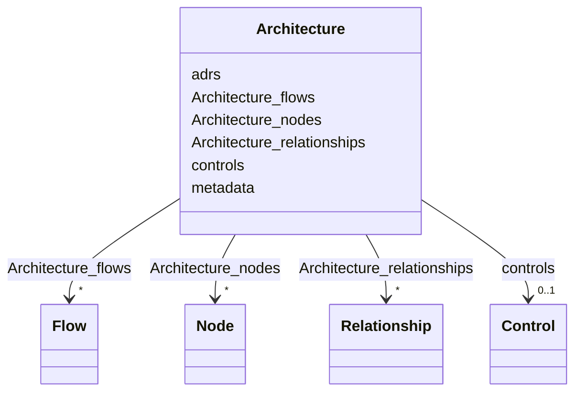

```mermaid
 classDiagram
    class Architecture
    click Architecture href "../Architecture"
      Architecture : adrs
        
      Architecture : Architecture_flows
        
          
    
        
        
        Architecture --> "*" Flow : Architecture_flows
        click Flow href "../Flow"
    

        
      Architecture : Architecture_nodes
        
          
    
        
        
        Architecture --> "*" Node : Architecture_nodes
        click Node href "../Node"
    

        
      Architecture : Architecture_relationships
        
          
    
        
        
        Architecture --> "*" Relationship : Architecture_relationships
        click Relationship href "../Relationship"
    

        
      Architecture : controls
        
          
    
        
        
        Architecture --> "0..1" Control : controls
        click Control href "../Control"
    

        
      Architecture : metadata
        
      
```
