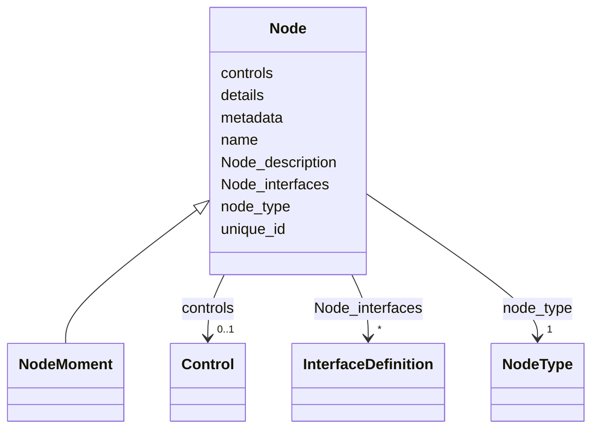

```mermaid
 classDiagram
    class Node
    click Node href "../Node"
      Node <|-- NodeMoment
        click NodeMoment href "../NodeMoment"
      
      Node : controls
        
          
    
        
        
        Node --> "0..1" Control : controls
        click Control href "../Control"
    

        
      Node : details
        
      Node : metadata
        
      Node : name
        
      Node : Node_description
        
      Node : Node_interfaces
        
          
    
        
        
        Node --> "*" InterfaceDefinition : Node_interfaces
        click InterfaceDefinition href "../InterfaceDefinition"
    

        
      Node : node_type
        
          
    
        
        
        Node --> "1" NodeType : node_type
        click NodeType href "../NodeType"
    

        
      Node : unique_id
        
      
```
