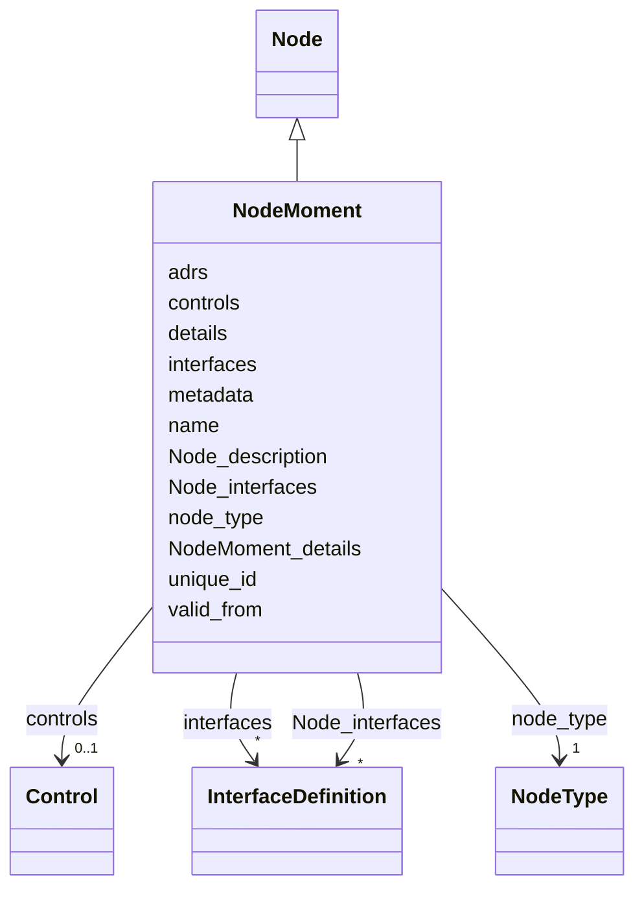

```mermaid
 classDiagram
    class NodeMoment
    click NodeMoment href "../NodeMoment"
      Node <|-- NodeMoment
        click Node href "../Node"
      
      NodeMoment : adrs
        
      NodeMoment : controls
        
          
    
        
        
        NodeMoment --> "0..1" Control : controls
        click Control href "../Control"
    

        
      NodeMoment : details
        
      NodeMoment : interfaces
        
          
    
        
        
        NodeMoment --> "*" InterfaceDefinition : interfaces
        click InterfaceDefinition href "../InterfaceDefinition"
    

        
      NodeMoment : metadata
        
      NodeMoment : name
        
      NodeMoment : Node_description
        
      NodeMoment : Node_interfaces
        
          
    
        
        
        NodeMoment --> "*" InterfaceDefinition : Node_interfaces
        click InterfaceDefinition href "../InterfaceDefinition"
    

        
      NodeMoment : node_type
        
          
    
        
        
        NodeMoment --> "1" NodeType : node_type
        click NodeType href "../NodeType"
    

        
      NodeMoment : NodeMoment_details
        
      NodeMoment : unique_id
        
      NodeMoment : valid_from
        
      
```
