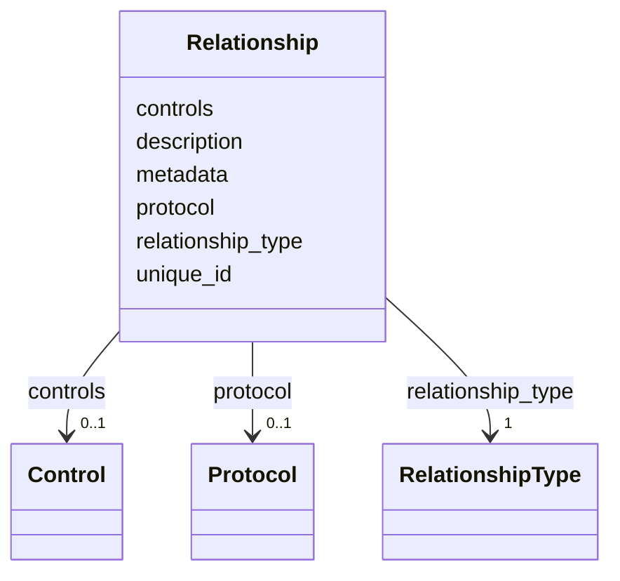

```mermaid
 classDiagram
    class Relationship
    click Relationship href "../Relationship"
      Relationship : controls
        
          
    
        
        
        Relationship --> "0..1" Control : controls
        click Control href "../Control"
    

        
      Relationship : description
        
      Relationship : metadata
        
      Relationship : protocol
        
          
    
        
        
        Relationship --> "0..1" Protocol : protocol
        click Protocol href "../Protocol"
    

        
      Relationship : relationship_type
        
          
    
        
        
        Relationship --> "1" RelationshipType : relationship_type
        click RelationshipType href "../RelationshipType"
    

        
      Relationship : unique_id
        
      
```
