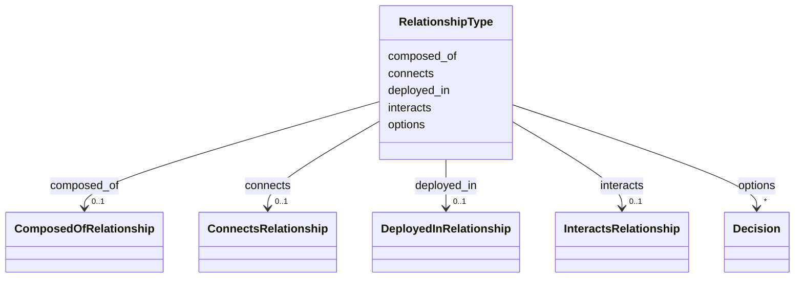

```mermaid
 classDiagram
    class RelationshipType
    click RelationshipType href "../RelationshipType"
      RelationshipType : composed_of
        
          
    
        
        
        RelationshipType --> "0..1" ComposedOfRelationship : composed_of
        click ComposedOfRelationship href "../ComposedOfRelationship"
    

        
      RelationshipType : connects
        
          
    
        
        
        RelationshipType --> "0..1" ConnectsRelationship : connects
        click ConnectsRelationship href "../ConnectsRelationship"
    

        
      RelationshipType : deployed_in
        
          
    
        
        
        RelationshipType --> "0..1" DeployedInRelationship : deployed_in
        click DeployedInRelationship href "../DeployedInRelationship"
    

        
      RelationshipType : interacts
        
          
    
        
        
        RelationshipType --> "0..1" InteractsRelationship : interacts
        click InteractsRelationship href "../InteractsRelationship"
    

        
      RelationshipType : options
        
          
    
        
        
        RelationshipType --> "*" Decision : options
        click Decision href "../Decision"
    

        
      
```
