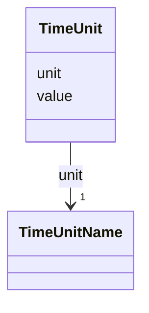

```mermaid
 classDiagram
    class TimeUnit
    click TimeUnit href "../TimeUnit"
      TimeUnit : unit
        
          
    
        
        
        TimeUnit --> "1" TimeUnitName : unit
        click TimeUnitName href "../TimeUnitName"
    

        
      TimeUnit : value
        
      
```
